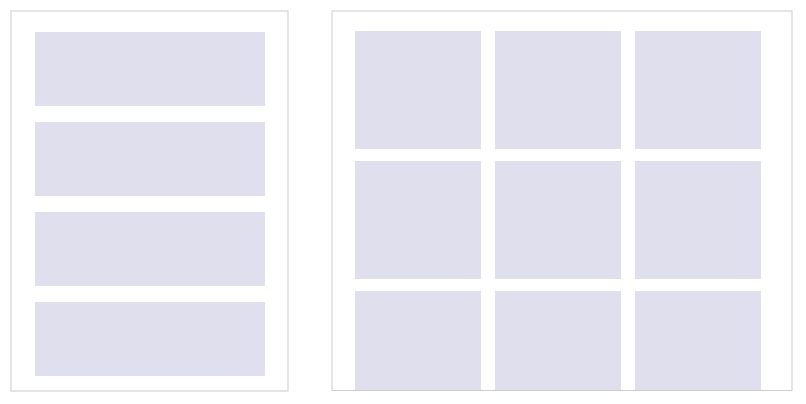
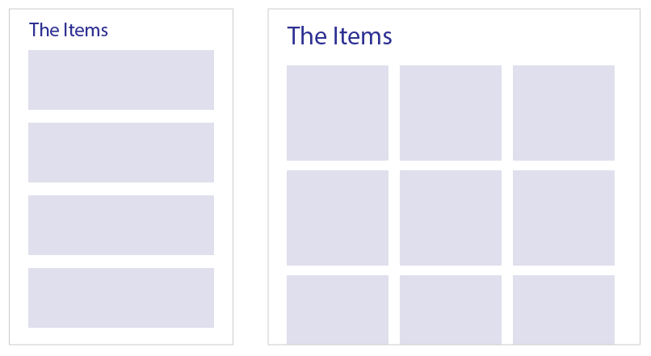
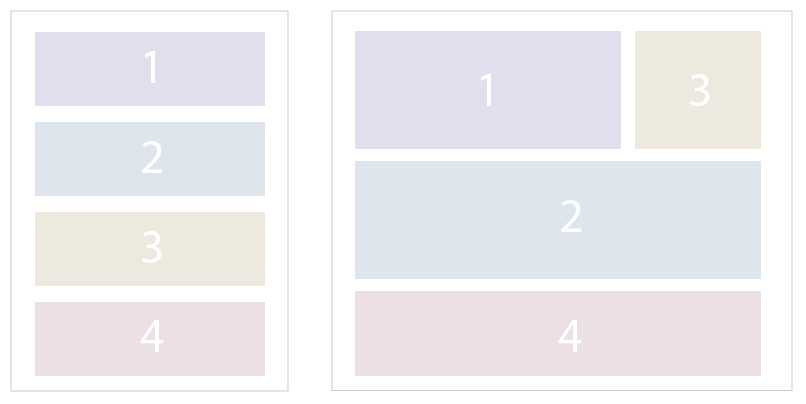

# Responsive UI

We support some basic primitives for responsive development.

The typical responsive needs are:
* Internally responsive library components
* Applying styles based on screen size
* Lightweight templating
* Branching content based on screen size
* Library components that demand the user to be responsive aware

How we satisfy each of these is described below.

It is important to use the Principle of Least Power when choosing which responsive technique
to apply to your situation. First, see if there are already library level internally responsive
components that can accomplish what you need. If not, go to the next level of power. If simply
using screen size based classes is enough to accomplish your design needs, then don't use templating.
If classes are insufficient, but templating gets the job done with minimum content repetition,
use that, and do not use branching any more than minimally necessary. Do feel revolted by excessive
use of copy and paste — it will make your app harder to maintain, more error prone, more difficult
to test, and more brittle.

## Internally responsive library components

Consider the following layout, handheld on the left, desktop on the right.



The technique of least possible power that we should first consider for the task is to use an
existing library component that would accomplish this responsive layout for us. And indeed there
is such a component, `LC.ItemList`, which will also incidentally handle the easily forgotten case
of empty list messaging.

```xml
<LC.ItemList Style='~Responsive HorizontalAlignment.Center' Items='items' rt-prop-children='WhenNonempty(items: seq&lt;Item&gt;'>
    <ItemCard rt-map='item := items' Item='item'/>
</LC.ItemList>
```

This code presupposes that `ItemCard` internally also implements responsive styling.

This is the simplest case of responsive styling, and it should be preferred. If there is not a library
primitive to do something that feels like it belongs in a top level library, and would be used by many
apps, it should be discussed and added to the library.

The example of `LC.ItemList` requires the user to specify that they want the `~Responsive` style,
the other option being `~Raw`, but in the general case, the internally responsive components
don't require any nudging to style themselves correctly. A subset of our library UI components
are already responsive aware. The user does not need to do anything special, the external API
(i.e. props) do not have anything to do with screen size, and the component internally does its
thing to style itself correctly depending on the current screen size. The gallery has a visuals
Desktop/Handheld toggle in the top nav to help you view the visuals for the specific screen size.
See [`LC.Button`](gallery:///%22Desktop%22/Components/%22Button%22)
and [`LC.Nav.Top`](gallery:///%22Desktop%22/Components/%22Nav_Top%22) for examples.


## Applying styles based on screen size

Consider the following layout.



The heading users a different font size based on the screen size. If there was no existing library
component to accomplish this, we would add one to the library, perhaps an `LC.Heading`. It may take
`Text: string` as a prop, and would have a simple `.render` file:

```xml
<div>
    <text>{=props.Text}</text>
</div>
```

To get our hands on the current screen size, we need to use the `LC.With.ScreenSize` component:

```xml
<LC.With.ScreenSize rt-prop-children='Content(screenSize: ScreenSize)'>
    <div class='text {screenSize.Class}'>
        <text>{=props.Text}</text>
    </div>
</LC.With.ScreenSize>
```

In the `.styles.fs` file, we use the standard StyleDSL patterns to style responsive content.
The only special thing is how we access the screen size classes. Using classes from the example above:

```fsharp
open LibClient.Responsive

let styles = compile [
    "text" => [
        // shared between screen sizes
        color colors.Primary.Main
    ] && [
        ScreenSize.Desktop.Class => [
            fontSize 20
        ]

        ScreenSize.Handheld.Class => [
            fontSize 16
        ]
    ]
]
```

Not the cleanest way for this particular example, but this also works, and is a good choice
in certain situations:

```fsharp
let styles = compile [
    "text && " + ScreenSize.Desktop.Class => [
        fontSize 20
    ]

    "text && " + ScreenSize.Handheld.Class => [
        fontSize 16
    ]
]
```

Likewise, using `sprintf` could work, as will string interpolation that's apparently coming in F# 5.

Note, that there's no notion of rule precedence in the current StyleDSL implementation,
so make sure your rules are specified XOR style, instead of having, say, a base font size
provided without a screen size class, and overwriting it with a screen size specific one.

It is unfortunate that the screen size class needs to be manually added to each element
that needs to be responsively styled. There's a low priority TODO item to make the
screen size class implicitly available.


## Lightweight Templating

Consider the following layout:



You'll notice that getting the blocks arranged in wrapping divs in such way that the desired
responsive layout can be achieved with just a clever combination of `FlexDirection` and similar
rules is likely impossible.

The least powerful solution to achieve this is lightweight templating — break the common content
out, give them names, and then set up the layout structure for each screen size, and drop the common
content in the right places. The code might look like this:

```xml
<rt-let name='block1'>
    ... markup defining block 1
</rt-let>

<rt-let name='block2'>
    ... markup defining block 2
</rt-let>

<rt-let name='block3'>
    ... markup defining block 3
</rt-let>

<rt-let name='block4'>
    ... markup defining block 4
</rt-let>

<LC.Responsive>
    <rt-prop name='Desktop(_)'>
        <div class='row'>
            {=block1}
            {=block3}
        </div>
        {=block2}
        {=block4}
    </rt-prop>
    <rt-prop name='Handheld(_)'>
        {=block1}
        {=block2}
        {=block3}
        {=block4}
    </rt-prop>
</LC.Responsive>
```

We generally strongly dislike indirection in layout out UI component trees, so `rt-let` should be
used sparingly, but responsive styling is the one place where it shines.

Note that `rt-let` allows you to define not just named blocks of elements, but also parametrized
functions that produce blocks of elements, which can come in rather handy.

The `LC.Responsive` component is a readability wrapper over `LC.With.ScreenSize` combined with an
`<rt-match>` on the `screenSize` value. If you're already using `LC.With.ScreenSize` to do class
based styling, might as well just write the `rt-match` instead of also adding `LC.Responsive` to the mix.

The reason this type of templating is called "lightweight" is because the "regular weight" version
would be to create a separate component, like `Foo.Layout` that takes the various blocks as props,
and in its render file contains the `<LC.Responsive>` block from above:

```xml
<LC.Responsive>
    <rt-prop name='Desktop(_)'>
        <div class='row'>
            {=props.Block1}
            {=props.Block3}
        </div>
        {=props.Block2}
        {=props.Block4}
    </rt-prop>
    <rt-prop name='Handheld(_)'>
        {=props.Block1}
        {=props.Block2}
        {=props.Block3}
        {=props.Block4}
    </rt-prop>
</LC.Responsive>
```

The `Foo.Base` component would then simply construct `<Foo.Layout>`, passing the separate blocks
as `rt-prop`s:

```xml
<Foo.Layout>
    <rt-prop name='Block1'>
        ... markup defining block 1
    </rt-prop>

    <rt-prop name='Block2'>
        ... markup defining block 2
    </rt-prop>

    <rt-prop name='Block3'>
        ... markup defining block 3
    </rt-prop>

    <rt-prop name='Block4'>
        ... markup defining block 4
    </rt-prop>
</Foo.Layout>
```

Since we'd be required to create a separate component, which is relatively
cumbersome, achieving the same goal without this extra effort is "lightweight".

## Branching content based on screen size

We've already seen the most benign example of branching based on the screen size, the
`LC.Responsive` block in the example above. The absolute minimum amount of content was branched.
On the other extreme is the full branching of the entire content, copy-and-paste style, with
tweaks then sprinkled in. This extreme should be avoided, but to some degree branching is necessary.

As you've seen above, the high-level primitive for branching content based on screen size is
the `LC.Responsive` component. You use it like this:

```xml
<LC.Responsive>
    <rt-prop name='Desktop(_)'>
        desktop-specific content
    </rt-prop>
    <rt-prop name='Handheld(_)'>
        handheld-specific content
    </rt-prop>
</LC.Responsive>
```

It's useful mostly in cases when you have a clean binary split between the two versions.
If you happen to have semantically similar content that needs to be styled, you should
use screen size classes to style the content (how to write the styles is in the next section).

```xml
<LC.Responsive>
    <rt-prop name='Desktop(screenSize: ScreenSize)'>
        <div class='label {screenSize.Class}'>desktop-specific content</div>
    </rt-prop>
    <rt-prop name='Handheld(screenSize: ScreenSize)'>
        <div class='label {screenSize.Class}'>handheld-specific content</div>
    </rt-prop>
</LC.Responsive>
```

It may be tempting to ad hoc your own class names — resist this temptation for the sake
of consistency.

Note that the screen size specific props take a parameter. It's not there to only make
`{screenSize.Class}` available to you (you could as well write `{ScreenSize.Desktop.Class}`
or `{ScreenSize.Handheld.Class}` to achieve the same effect), but also to ensure that the
two branches are lazy, and only the necessary one is evaluated.

When you have a more involved situation, where some content is shared, while other content
is branched, you can use the low level primitive, `LC.With.ScreenSize`:

```xml
<LC.With.ScreenSize rt-prop-children='Content(screenSize: ScreenSize)'>
    <div class='shared-content'>some shared content</div>
    <div class='branched-styling {screenSize.Class}'>some responsive styled shared content</div>
    <rt-match what='screenSize'>
        <rt-case is='ScreenSize.Desktop'>
            some desktop content
        </rt-case>
        <rt-case is='ScreenSize.Handheld'>
            some handheld content
        </rt-case>
    </rt-match>
</LC.With.ScreenSize>
```

Do not mix the two. If your needs are not satisfied with `LC.Responsive` and you have to
use `LC.With.ScreenSize`, don't also bring in `LC.Responsive` into the mix, use a simple
`rt-match` as shown above.

Essentially, all the value that `LC.Responsive` brings to the table over `LC.With.ScreenSize` is removing two extra lines of code and one level of nesting.


## Library components that demand the user to be responsive aware

Some library UI components force the user to make explicit choices about how they will
handle various screen sizes. For example, [`LC.Nav.Top`](gallery:///%22Desktop%22/Components/%22Nav_Top%22) requires you to provide the top
nav content for the handheld and desktop screen sizes separately. This is one of those
cases where falling back on some magic defaults is likely to result in a subpar user
experience, so we force the developer (and, by extension, product designer) to make
an explicit choice. This is often a healthy pattern to follow.
